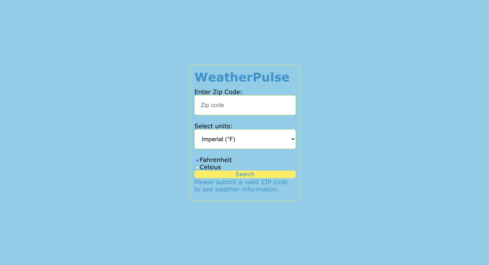
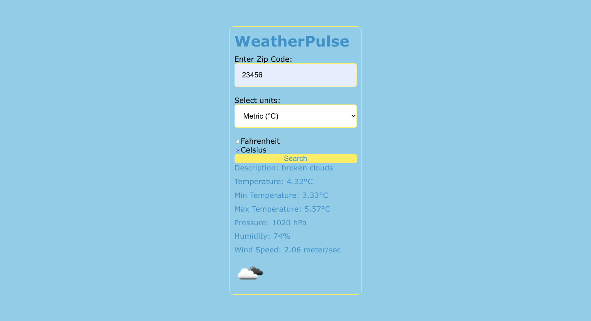
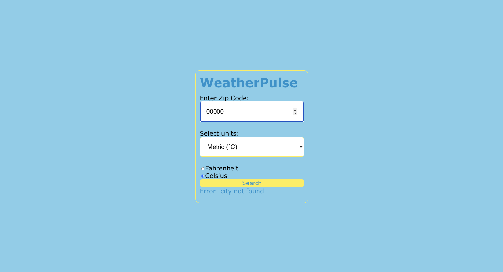

# ACS 3330 Assignment 2 - WeatherPulse React App

WeatherPulse is a simple React application that allows users to get weather information based on a provided ZIP code utilizing OpenWeatherMap.

## Features

- **Weather Search:** Enter a ZIP code and select units (Imperial or Metric) to retrieve current weather data.
- **Weather Data:** Displays details including weather description, temperature, pressure, humidity, wind speed, and weather icon.

## Usage

1. Obtain an API key from [OpenWeatherMap](https://openweathermap.org/) and set it as an environment variable in your project:

   ```bash
   REACT_APP_OPENWEATHERMAP_API_KEY=your_api_key_here
   ```

2. Start the development server:

   ```bash
   npm start
   ```

3. Open your browser and go to [http://localhost:3000](http://localhost:3000) to view the app.




